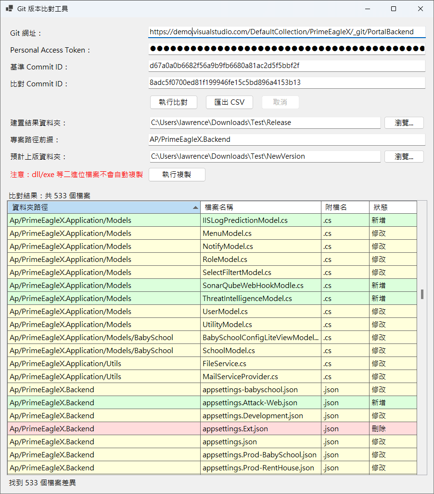
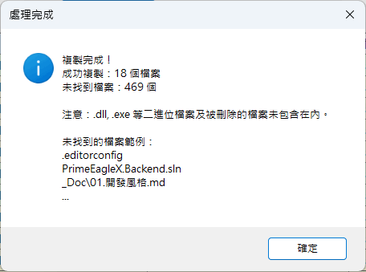
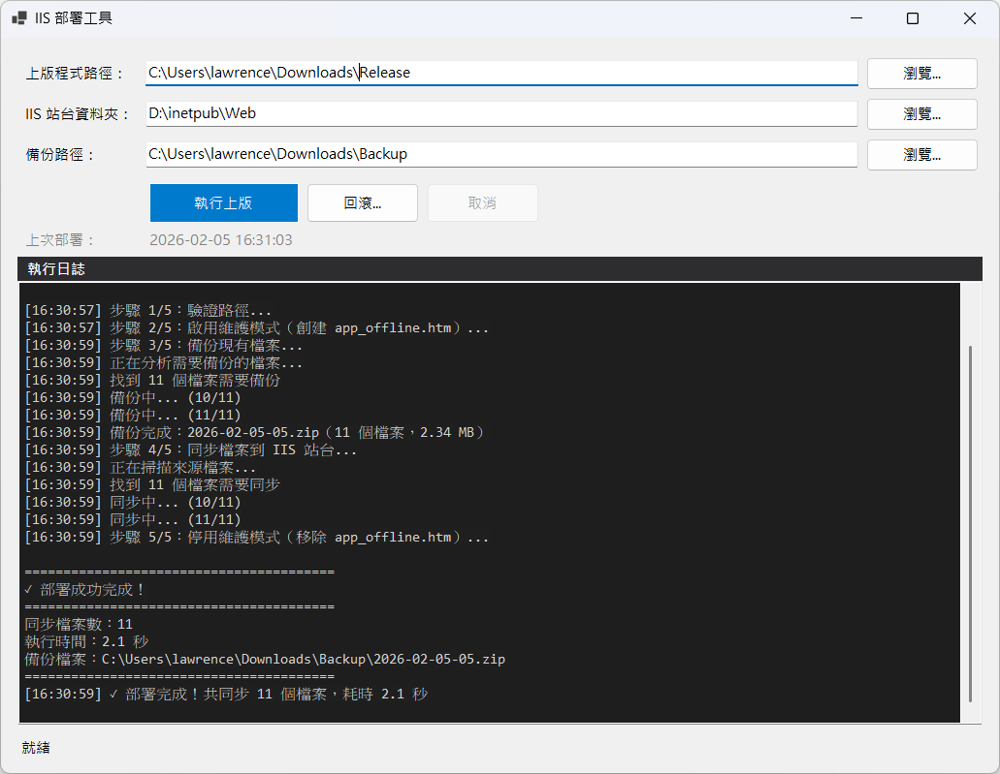
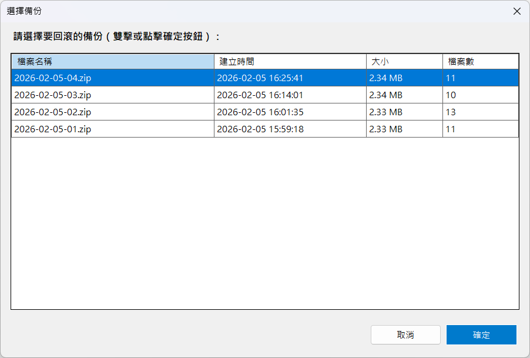

# Git Release & IIS Deployment Tools - Git 版本比對與 IIS 部署工具

## 專案概述

本解決方案包含兩個配合使用的工具，協助開發人員完成從版本比對到自動化部署的完整上版流程：

1. **GitReleaseDiff**：比對 Git commit 差異，自動複製準備上版的程式檔案
2. **IISDeploymentTool**：自動化 IIS 網站部署流程，包含備份、維護模式管理和回滾機制

這兩個工具可以獨立使用，也可以配合使用以實現完整的自動化上版流程。

---

## 一、GitReleaseDiff - Git 版本比對工具

### 專案目的

此工具旨在協助開發人員在進行程式上版時，能夠快速列出「本次上版程式」與「上次上版程式」之間的檔案差異清單。透過輸入同一分支的兩個 Commit ID，即可自動查詢並顯示所有變更的檔案。

### 功能說明

#### 主要功能

1. **版本差異比對**
   - 支援輸入 Azure DevOps / TFS 的 Git 儲存庫網址
   - 支援輸入 Commit ID（完整或短碼格式）
   - 自動查詢兩個 Commit 之間的所有檔案差異

2. **結果呈現**
   - 依資料夾路徑和檔案名稱排序顯示
   - 相同資料夾的檔案會集中顯示
   - 顯示檔案附檔名，方便依檔案類型排序
   - 以顏色區分檔案狀態：
     - 🟢 新增（淺綠色）
     - 🟡 修改（淺黃色）
     - 🔴 刪除（淺紅色）
     - 🔵 重新命名（淺藍色）

3. **CSV 匯出**
   - 支援將比對結果匯出為 CSV 格式
   - 包含欄位：資料夾路徑、檔案名稱、附檔名、狀態、完整路徑、舊檔案路徑

4. **設定記憶**
   - 自動記住上次輸入的設定
   - 下次啟動時自動載入

5. **使用者體驗**
   - 處理中鎖定 UI 防止誤操作
   - 顯示進度條和處理狀態
   - 支援取消操作

6. **自動複製靜態檔案**
   - 自動將差異檔案從 CI 建置目錄複製到上版目錄
   - 支援選擇建置結果資料夾與預計上版資料夾
   - 自動維持資料夾層級結構
   - 複製前自動檢查並提示目標資料夾狀態
   - 針對已存在的目標資料夾提供清空確認（含路徑提示）

7. **強制複製檔案清單**
   - 支援手動指定要強制複製的檔案（如建置產生的 .dll、.exe 等二進位檔案）
   - 支援多行輸入，每行一個檔案路徑
   - **支援萬用字元匹配**：
     - `*` - 匹配任意數量的字元（例如：`bin\*.dll` 匹配所有 dll 檔案）
     - `?` - 匹配單一字元（例如：`app?.dll` 匹配 app1.dll、app2.dll）
     - `**` - 遞迴搜尋所有子目錄（例如：`lib\**\*.config` 遞迴搜尋所有 config 檔案）
   - 自動記憶上次輸入的檔案清單
   - 與 Git 差異檔案分開統計，清楚顯示複製來源

### 使用說明

1. 啟動程式後，輸入以下資訊：
   - **Git 網址**：Azure DevOps / TFS 的 Git 儲存庫網址
     - 例如：`https://dev.azure.com/organization/ProjectName/_git/RepoName`
   - **Personal Access Token (PAT)**：Azure DevOps 的個人存取權杖（必填）
     - 取得方式：登入 Azure DevOps → 右上角使用者設定 → Personal access tokens → New Token
     - 所需權限：至少需要 `Code (Read)` 權限
     - 輸入後會以遮罩方式顯示（●●●）
   - **基準 Commit ID**：上次上版的 Commit ID（支援短碼）
   - **比對 Commit ID**：本次上版的 Commit ID（支援短碼）

2. 點擊「執行比對」按鈕

3. 等待處理完成，查看檔案差異列表

4. 如需匯出結果，點擊「匯出 CSV」按鈕

5. **自動複製檔案**（比對完成後）：
   - 選擇「建置結果資料夾」（CI Build Artifacts）
   - **（可選）** 輸入「專案路徑前綴」
     - 適用於多專案方案：若 Git 差異路徑包含專案資料夾前綴，但建置輸出不包含，請填寫此欄位
     - 例如：`Application` 或 `Application.UnitTest/`
   - 選擇「預計上版資料夾」（Deployment Folder）
   - **（可選）** 輸入「強制複製檔案清單」
     - 用於指定建置產生的二進位檔案（如 .dll、.exe）或其他不在 Git 差異中的檔案
     - 每行輸入一個檔案路徑，支援萬用字元：
       ```
       bin\MyApp.dll
       bin\*.exe
       lib\**\*.config
       plugins\**\*.dll
       ```
     - 萬用字元說明：
       - `bin\*.dll` - 匹配 bin 資料夾中所有 .dll 檔案
       - `lib\**\*.config` - 遞迴搜尋 lib 及其子資料夾中所有 .config 檔案
       - `app?.dll` - 匹配 app1.dll、app2.dll 等單字元變化
   - 點擊「執行複製」按鈕
   - 系統會：
     1. 複製 Git 差異中的檔案
     2. 複製強制指定的檔案
     3. 顯示詳細統計（分別列出兩種來源的複製結果）

6. 以下為應用程式執行畫面範例：
   
   

#### Personal Access Token (PAT) 安全提示

- PAT 會被加密儲存在本機，但仍建議定期更新
- 建議建立專用的 PAT，僅授予必要的權限（Code - Read）
- 不要與他人分享您的 PAT
- 如果 PAT 外洩，請立即在 Azure DevOps 中撤銷該 Token

---

## 二、IISDeploymentTool - IIS 自動化部署工具

### 專案目的

此工具旨在自動化 IIS 網站的部署流程，提供安全、可靠、可回滾的部署機制。透過自動維護模式管理和備份機制，確保部署過程中用戶體驗和數據安全。

### 功能說明

#### 主要功能

1. **自動化部署流程**
   - **步驟 1：路徑驗證** - 確認所有路徑存在且可訪問
   - **步驟 2：啟用維護模式** - 創建 `app_offline.htm`，使 IIS 進入維護模式，防止用戶訪問半完成狀態
   - **步驟 3：智能備份** - 比對上版檔案，僅備份將被覆蓋的檔案（保持資料夾結構）
   - **步驟 4：檔案同步** - 將上版程式複製到 IIS 站台，自動覆蓋舊檔案
   - **步驟 5：停用維護模式** - 移除 `app_offline.htm`，恢復網站正常訪問

2. **智能備份機制**
   - 備份檔名格式：`yyyy-MM-dd-NN.zip`（例如：`2026-02-05-01.zip`）
   - 同一天多次部署，流水號自動遞增（01, 02, 03...）
   - 僅備份將被覆蓋的檔案，節省空間和時間
   - 備份內容保持完整的資料夾結構，便於追溯和還原
   - 使用 ZIP 壓縮，節省磁碟空間

3. **安全的回滾機制**
   - 部署失敗時自動提供回滾選項
   - 一鍵從備份還原到部署前狀態
   - 回滾過程同樣使用維護模式，確保一致性

4. **路徑記憶功能**
   - 自動記住三個路徑欄位：
     - 上版程式路徑（來源資料夾，通常是 GitReleaseDiff 複製的結果）
     - IIS 站台資料夾路徑（目標資料夾）
     - 備份路徑（備份存放位置）
   - 記錄上次部署時間，便於追蹤

5. **實時進度顯示**
   - 下方狀態列顯示當前處理步驟
   - Marquee 樣式進度條提供視覺反饋
   - 詳細日誌區域記錄所有操作（帶時間戳）
   - 支援取消操作（會嘗試清理維護模式）

6. **維護模式管理**
   - 自動創建美觀的維護頁面（`app_offline.htm`）
   - 維護模式期間，IIS 會卸載應用程式池，釋放所有檔案鎖定
   - 自動處理檔案鎖定問題（重試機制）
   - 部署失敗或取消時自動清理維護模式

### 使用說明

1. **首次使用設定**：
   - 啟動 IISDeploymentTool
   - 輸入三個路徑：
     - **上版程式路徑**：準備上版的檔案所在資料夾（例如：`D:\Deploy\Release`）
       - 通常是使用 GitReleaseDiff 複製好的檔案
     - **IIS 站台資料夾**：IIS 網站的根目錄（例如：`C:\inetpub\wwwroot\MyApp`）
     - **備份路徑**：備份檔案存放位置（例如：`D:\Backups\MyApp`）
   - 這些路徑會被自動記憶，下次使用時自動載入

2. **執行部署**：
   - 點擊「執行上版」按鈕
   - 確認顯示的路徑資訊
   - 觀察日誌區域的即時進度
   - 等待部署完成

3. **檢視結果**：
   - 部署成功時會顯示詳細統計：
     - 同步檔案數
     - 執行時間
     - 備份檔案路徑
   - 備份檔案會保存在備份路徑中，檔名格式為 `yyyy-MM-dd-NN.zip`

4. **處理部署失敗**：
   - 如果部署失敗，系統會詢問是否回滾
   - 選擇「是」將從備份還原到部署前狀態
   - 選擇「否」則保持當前狀態（可稍後手動處理）

5. **取消操作**：
   - 部署過程中可點擊「取消」按鈕
   - 系統會停止當前操作並嘗試清理維護模式

6. 以下為應用程式執行畫面範例：
   
   

### 備份管理建議

- 定期清理舊備份檔案，節省磁碟空間
- 建議至少保留最近 7-30 天的備份
- 重要版本的備份可以移至其他位置長期保存
- 備份檔案命名包含日期，便於識別和管理

### 注意事項

- **管理員權限**：操作 IIS 資料夾可能需要管理員權限，建議以管理員身分執行
- **網路訪問**：部署期間網站會進入維護模式，用戶將看到維護頁面
- **檔案鎖定**：維護模式會自動解決大部分檔案鎖定問題
- **磁碟空間**：確保備份路徑有足夠的磁碟空間

---

## 三、典型工作流程

結合兩個工具的完整上版流程如下：

### 流程一：從 Git 比對到部署

```
1. 使用 GitReleaseDiff 比對版本差異
   ├─ 輸入 Git URL 和兩個 Commit ID
   ├─ 執行比對，查看差異清單
   └─ 選擇建置結果資料夾和預計上版資料夾
      ├─ 輸入強制複製檔案清單（如 bin\*.dll）
      └─ 執行複製

2. 檢查複製結果
   ├─ 確認所有必要檔案已複製
   ├─ 檢查未找到的檔案（如有）
   └─ 確認強制複製的檔案已包含

3. 使用 IISDeploymentTool 部署到 IIS
   ├─ 啟動 IISDeploymentTool
   ├─ 上版程式路徑：指向 GitReleaseDiff 複製的結果資料夾
   ├─ IIS 站台資料夾：指向 IIS 網站根目錄
   ├─ 備份路徑：指定備份存放位置
   └─ 執行上版

4. 驗證部署結果
   ├─ 檢查網站是否正常運行
   ├─ 確認新功能是否生效
   └─ 如有問題，使用回滾功能恢復
```

### 流程二：緊急修復與快速部署

```
1. 識別問題版本
   └─ 使用 GitReleaseDiff 比對當前版本和問題版本

2. 準備修復檔案
   └─ 使用 GitReleaseDiff 複製修復版本的差異檔案

3. 快速部署
   ├─ 使用 IISDeploymentTool 執行部署
   └─ 自動備份當前版本（便於再次回滾）

4. 驗證修復
   └─ 如果修復失敗，立即使用回滾功能恢復
```

---

## 系統需求

- **作業系統**：Windows 10 或更高版本
- **執行環境**：.NET 10.0 Runtime 或更高版本
- **網路連線**：用於存取 Azure DevOps / TFS API（僅 GitReleaseDiff）
- **權限需求**：
  - GitReleaseDiff：一般使用者權限
  - IISDeploymentTool：建議以管理員身分執行

---

## 專案結構

```
GitReleaseDiff/
├── GitReleaseDiff.sln               # 方案檔案
├── README.md                        # 本文件
├── doc/
│   ├── Screenshot.png               # GitReleaseDiff 執行畫面
│   └── Screenshot2.png              # 輸出結果畫面
├── src/
│   ├── GitReleaseDiff/              # Git 版本比對工具
│   │   ├── Models/                  # 資料模型
│   │   │   ├── AppSettings.cs       # 應用程式設定
│   │   │   └── FileDiffInfo.cs      # 檔案差異資訊
│   │   ├── Services/                # 服務類別
│   │   │   ├── GitService.cs        # Git 操作服務
│   │   │   ├── SettingsService.cs   # 設定儲存服務
│   │   │   ├── CsvExportService.cs  # CSV 匯出服務
│   │   │   └── FileCopyService.cs   # 檔案複製服務
│   │   ├── MainForm.cs              # 主視窗邏輯
│   │   ├── MainForm.Designer.cs     # 主視窗設計
│   │   └── Program.cs               # 程式進入點
│   └── IISDeploymentTool/           # IIS 自動化部署工具
│       ├── Models/                  # 資料模型
│       │   ├── DeploymentSettings.cs   # 部署設定
│       │   ├── DeploymentStep.cs       # 部署步驟列舉
│       │   ├── DeploymentResult.cs     # 部署結果
│       │   └── BackupInfo.cs           # 備份資訊
│       ├── Services/                # 服務類別
│       │   ├── SettingsService.cs      # 設定儲存服務
│       │   ├── DeploymentService.cs    # 部署協調服務
│       │   ├── BackupService.cs        # 備份與壓縮服務
│       │   ├── IISMaintenanceService.cs # 維護模式管理
│       │   ├── FileSyncService.cs      # 檔案同步服務
│       │   └── RollbackService.cs      # 回滾服務
│       ├── MainForm.cs              # 主視窗邏輯
│       ├── MainForm.Designer.cs     # 主視窗設計
│       └── Program.cs               # 程式進入點
└── tests/
    └── GitReleaseDiff.Tests/        # 單元測試專案
        ├── FileDiffInfoTests.cs     # 檔案差異模型測試
        ├── GitServiceTests.cs       # Git 服務測試
        ├── CsvExportServiceTests.cs # CSV 匯出測試
        ├── SettingsServiceTests.cs  # 設定服務測試
        └── FileCopyServiceTests.cs  # 檔案複製測試
```

---

## 建置與執行

### 建置專案

```bash
# 建置整個解決方案
cd GitReleaseDiff
dotnet build --configuration Release

# 僅建置 GitReleaseDiff
dotnet build src/GitReleaseDiff/GitReleaseDiff.csproj --configuration Release

# 僅建置 IISDeploymentTool
dotnet build src/IISDeploymentTool/IISDeploymentTool.csproj --configuration Release
```

### 執行測試

```bash
dotnet test --configuration Release
```

### 執行程式

#### GitReleaseDiff

```bash
# 使用 dotnet run
dotnet run --project src/GitReleaseDiff

# 或直接執行編譯後的執行檔
src\GitReleaseDiff\bin\Release\net10.0-windows\GitReleaseDiff.exe
```

#### IISDeploymentTool

```bash
# 使用 dotnet run
dotnet run --project src/IISDeploymentTool

# 或直接執行編譯後的執行檔（建議以管理員身分執行）
src\IISDeploymentTool\bin\Release\net10.0-windows\IISDeploymentTool.exe
```

---

## 使用的套件

| 套件名稱 | 版本 | 授權 | 用途 |
|---------|------|------|------|
| Newtonsoft.Json | 13.0.3 | MIT | JSON 序列化與反序列化 |
| System.Security.Cryptography.ProtectedData | 10.0.1 | MIT | Windows DPAPI 資料加密（GitReleaseDiff） |
| xUnit | 2.6.2 | Apache 2.0 | 單元測試框架 |

> 所有使用的套件皆為允許商用的開源授權。

---

## 修改歷程

| 版本 | 日期 | 說明 |
|------|------|------|
| 1.0.0 | 2025-12-31 | GitReleaseDiff 初始版本發布 |
| 1.1.0 | 2026-01-01 | 新增自動複製上版差異檔案功能 |
| 1.2.0 | 2026-02-05 | 新增強制複製檔案清單功能，支援萬用字元（`*`、`?`、`**`）匹配 |
| 2.0.0 | 2026-02-05 | **新增 IISDeploymentTool** - IIS 自動化部署工具，包含自動備份、維護模式管理、智能備份和回滾機制 |

---

## 開發者

本專案遵循 Clean Code 原則開發，所有類別、屬性、方法皆使用繁體中文進行文件說明。

## 授權

本專案僅供內部使用。
